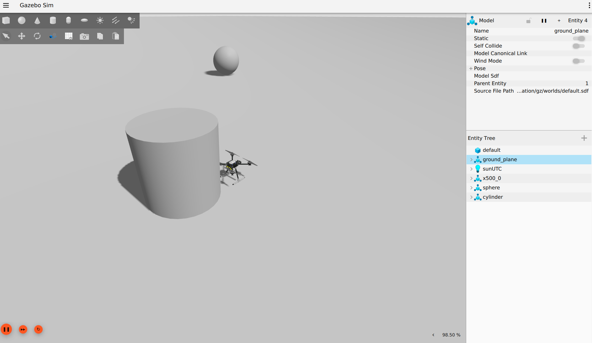

# UAV-Thread-Detection-And-Neutralization



An advanced UAV which can auto detect the intruder with computer vision and lidar sensors to map  around the near by restricted area and give up the alaram for thread near by


# Autonomous Drone Landing Mission POC

This project implements a simulated autonomous drone mission using **ROS 2 Humble**, **PX4 Autopilot**, and **Gazebo**.


## Project Architecture

*   **Simulation Environment:** Gazebo (Garden/Harmonic) via `ros_gz_sim`.
*   **Flight Control:** PX4 Autopilot running in SITL (Software In The Loop) mode.
*   **Communication Bridge:** Micro-XRCE-DDS-Agent bridging PX4 (uORB) and ROS 2 topics.
*   **Mission Logic:** A custom ROS 2 Python node (`mission_control.py`) that sends trajectory setpoints and high-level commands (Arm, Takeoff, Land).

## Prerequisites

Ensure you have the following installed on Ubuntu 22.04:
*   ROS 2 Humble
*   PX4 Autopilot Toolchain
*   Micro-XRCE-DDS-Agent
*   Gazebo (`ros-humble-ros-gz`)

## Installation

1.  **Clone the repository:**
    ```bash
    cd ~/drone_ws/src
    # Clone your repo here
    ```

2.  **Build the ROS 2 workspace:**
    ```bash
    cd ~/drone_ws
    colcon build --symlink-install
    source install/setup.bash
    ```

## Usage

Running the simulation requires **4 separate terminals**.

### Terminal 1: Micro-XRCE-DDS Agent
Starts the communication bridge between the drone and ROS 2.
```bash
MicroXRCEAgent udp4 -p 8888


cd ~/drone_ws
source install/setup.bash
ros2 launch poc1_landing_world world_new.launch.py


cd ~/drone_ws
source install/setup.bash
ros2 run poc1_landing_world mission_control.py


cd ~/PX4-Autopilot
PX4_SYS_AUTOSTART=4001 PX4_GZ_MODEL_POSE="0,0" ./build/px4_sitl_default/bin/px4